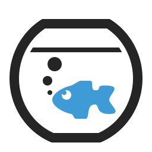

# Heringsfish Command Line Interface (cli)

> Command Line Interface to manages the [Glassfish][glassfish] / [Payara][payara] Application Server and the maven deployment on local machine


## Table of Content

* [Overview](#user-content-overview)
* [Requirement](#user-content-requirement)
* [Installation](#user-content-installation)
* [Find Help](#user-content-find-help)
* [Quick Startup](#user-content-quick-startup)
* [Configure](#user-content-configure)
    * [Example of Configure](#user-content-example-of-configure)
    * [List of Action](#user-content-list-of-action)
    * [JDBC Configuration](#user-content-jdbc-configuration)
    * [Replaced Variables](#user-content-replaced-variables)
    * [Environment Variables](#user-content-environment-variables)
* [Road Map](#user-content-road-map)
* [History](#user-content-history)
* [License](#user-content-license)
* [Third Party](#user-content-third-party)


## Overview

The CLI allows you to a [GlassFish][glassfish] or [Payara][payara] Application Server easy to use and a encapsulated development environment for your JEE set 7 project.


## Requirement

The following programs or modules are necessary:

* [Node JS][nodejs]: This cli is tested with the version 0.12.x
* Application Server [Glassfish 4.1][glassfish] or [Payara 4.1][payara]: Just install the server somewhere on your computer.
* [Maven][maven]: The command `mvn` should in your `PATH` or setup in the configuration
* An Java IDE :-)


## Installation

Global install:

```sh
$ npm install -g heringsfish-cli
```

Github

```sh
$ cd /path/to/your/projects
$ git clone https://github.com/blueskyfish/heringsfish-cli.git
$ cd heringsfish-cli
$ npm install
$ npm test
$ npm link
```

**Note**: the command `npm link` creates an short link to the program. Now your are able to type in your
console window `hf ...`. May you need to call `sudo npm link`.


## Find Help

Every action has a help or explanation page.

The command `hf help [action]` shows the help or explanation page. The help command shows all possible actions, when omitted the action parameter.

```sh
$ hf help
$ hf help init
$ hf help build
```


## Quick Startup

```sh
( 1) $ cd /your/project
( 2) $ hf init
( 3) $ hf config name "Your Project"
( 4) $ hf config server.home /path/to/application/server
( 5) $ hf config domain.home /path/to/domains
( 6) $ hf config domain.name your-project
( 7) $ hf config domain.ports.base 30000
( 8) $ hf config domain.deploy.nameOfWarApp "{project.home}/target/your-project.war"
( 9) $ hf create
(10) $ hf start
(11) $ hf jdbc create --name testDB
(12) $ hf deploy
(13) $ open "http://localhost:30048/
(14) $ open "http://localhost:30080/your-project
(15) $ hf undeploy
(16) $ hf stop
(17) $ hf remove
```

1. Change into your project
2. Initialize the configuration for your project.
3. Set your project name
4. Set the home of the application
5. Set the domain home path
6. Set the domain name (without a whitespace)
7. Set the base port (all other ports are calculated from this port)
8. Set the file deploying on the application server
9. Set create the domain
10. Start the application server
11. Create a JDB connection pool and JDBC resource
12. Start the deployment
13. Open the Admin Console of the application server
14. Open your deployed web/rest (etc) application
15. Undeploy the deployed application
16. Stop the application server
17. Remove and delete the domain.


## Configure

The configure settings are in the file `server-config.json`. This file is in the project root directory and has format `JSON`.

There are 2 ways to edit the configuration:

* call the cli with the action `config`<br>
  example: `$ hf config server.home "{project.home}/tools/glassfish4"`
* edit the file `server-config.json` directly.<br>
  example: `$ nano server-config.json`

### Table of Configurable Settings

| Settings            | Type         | Description
|---------------------|--------------|--------------------------------------------------------------------
| `name`              | String       | The application name
| `version`           | String       | A version
| `server.home`       | String       | The path to the Application Server
| `maven.home`        | String       | The path to the Maven installation
| `maven.setting`     | String       | The Maven settings.xml file
| `maven.project`     | String       | The `om.xml`of the Project.
| `domain.name`       | String       | The domain name in the Application Server.
| `domain.home`       | String       | The path to the domain directory.
| `domain.deploy`     | Map          | A map with the deployment files.
| `domain.ports.base` | Number       | The base port of the application (Admin Console Port is `+ 48`, The application is on `+ 80`).
| `domain.jdbc`       | Map          | A map with the jdbc names and their settings.
| `command.timeout`   | Number       | The timeout in milliseconds. If the value is `0`, then it is running infinity.
| `command.asadmin`   | Object       | The `asAdmin` command.
| `env`               | Object       | A key value map for the environment variables that is setting for the Application Server.

### Example of Configure

```json
{
    "name": "test-project",
    "version": "0.1.0-SNAPSHOT",
    "server": {
        "home": "{user.home}/bin/payara-4.1.1.154"
    },
    "maven": {
        "home": "{user.home}/bin/maven-3.3.4",
        "setting": "{project.home}/setting.xml",
        "project": "{project.home}/projects/pom.xml"
    },
    "domain": {
        "name": "test-project",
        "home": "{project.home}/domains",
        "deploy": {
            "rest-provider": "{project.home}/projects/rest-provider/target/rest-provider-0.1.0-SNAPSHOT.war",
            "business-beans": "{project.home}/projects/business-beans/target/business-beans-0.1.0-SNAPSHOT.jar"
        },
        "ports": {
            "base": 50000
        },
        "jdbc": {
            "testDB": {
                "dataSourceClassName": "com.mysql.jdbc.jdbc2.optional.MysqlDataSource",
                "restype": "javax.sql.DataSource",
                "properties": {
                    "user": "user",
                    "password": "password",
                    "url": "jdbc:mysql://localhost:3306/test"
                },
                "description": "This is the Test Database"
            }
        }
    },
    "command": {
        "timeout": 120000,
        "asadmin": {
            "win32": "{server.home}/bin/asadmin.bat",
            "unix": "{server.home}/bin/asadmin"
        }
    },
    "env": {
        "project.home": "{project.home}",
        "user.home": "{user.home}",
        "project.name": "{project.name}",
        "project.version": "{project.version}",
        ...
    }
}
```


### List of Action

Aktion      | Optional additional Arguments  | Description
------------|--------------------------------|------------------------------------------------------------
`init`      | -                              | Create the config settings in the current project folder.
`config`    |                                | Set a configuration setting.
            | `key value`                    | the key and its value. It can be more then a key value pair.
            | `-l` or `--list`               | Show the current configuration.
            | `key --delete`                 | Delete a configuration setting.
`create`    | -                              | Creates the domain on the application server.
`start`     | -                              | Starts the application server with the domain.
`restart`   |                                | Stops and starts the application server with the domain.
            | `-k` or `--kill`               | Specifies whether the domain is killed by using functionality of the operating system to terminate the domain process.
`deploy`    |                                | Build the application with maven and deploy on the application server..
            | `application`                  | the name of the deploying application. If no application is specified, all Applications are deployed.
            | `--nobuild`                    | Disable the maven build process before deploying.
            | `--skip`                       | Skip to execute the test cases.
            | `-c` or `--clean`              | Add the clean goal to the maven build process.
            | `-p profiles`                  | Add the maven profile(s). To separated more profiles with `,`.
            | `--profile=profiles`           | Add the maven profile(s). To separated more profiles with `,`.
`build`     |                                | build the application with maven
            | `--skip`                       | Skip to execute the test cases.
            | `-c` or `--clean`              | Add the clean goal to the maven build process.
            | `-p profiles`                  | Add the maven profile(s)
            | `--profile=profiles`           | Add the maven profile(s)
`test`      |                                | Executes the maven test goal.
            | `-c` or `--clean`              | Add the clean goal to the maven build process.
            | `-p profiles`                  | Add the maven profile(s)
            | `--profile=profiles`           | Add the maven profile(s)
`clean`     |                                | Execute maven for clean the target directories.
`list`      |                                | Display either the domains of the application server or the list of deployed application on the server.
            | `--app`                        | Display the deployed application on the application server.
            | `-d` or `--domain`             | Display the domains of the application server.
`undeploy`  |                                | Undeploy and remove the application from the application server.
            | `application`                  | the name of the deploying application. If no application is specified, all Applications are undeployed.
`redeploy`  |                                | Unfortunately it is not implemented yet. Instead use the action `stop` and then `start`.
`stop`      |                                | Stops the application server with the domain.
            | `-k` or `--kill`               | Specifies whether the domain is killed by using functionality of the operating system to terminate the domain process.
`remove`    | -                              | Remove and delete the domain on the application server.
`jdbc`      | `list`                         | Show all JDBC connection pools and JDBC resources
            | `create -n jdbcName`           | Create the JDBC connection pool and the JDBC resource from the given jdbc name.
            | `delete -n jdbcName`           | Delete the JDBC connection pool and the JDBC resource from the given jdbc name.
            | `ping -n jdbcName`             | Ping and validate the JDB connection pool and the JDBC resource from given jdbc name.


### JDBC Configuration


#### Documentation on Oracle

* Create JDBC Connection Pool<br>
  https://docs.oracle.com/cd/E26576_01/doc.312/e24938/create-jdbc-connection-pool.htm#GSRFM00036
* Create JDBC Resource<br>
  https://docs.oracle.com/cd/E26576_01/doc.312/e24938/create-jdbc-resource.htm#GSRFM00037
* Delete JDBC Connection Pool<br>
  https://docs.oracle.com/cd/E26576_01/doc.312/e24938/delete-jdbc-connection-pool.htm#GSRFM00088
* Delete JDBC Resource<br>
  https://docs.oracle.com/cd/E26576_01/doc.312/e24938/delete-jdbc-resource.htm#GSRFM00089
* Ping JDBC Connection Pool<br>
  https://docs.oracle.com/cd/E26576_01/doc.312/e24938/ping-connection-pool.htm#GSRFM00214


### Replaced Variables

Certain variables can be replaced. The Application Server is included in the project. By means of the variable project.home the directory of the project can be used.

For Example:
```
{
  "server": {
    "name": "${project.home}/tools/payara-4.1.1.154"
  }
}
```

| Name              | Value or description
|-------------------|-----------------------------------
| `project.home`    | The directory of the project
| `user.home`       | The user home directory
| `domain.name`     | The name of the domain
| `domain.home`     | The domain home directory
| `version`         | The project version
| `project.version` | The project version
| `name`            | The project name
| `project.name`    | The project name


### Environment Variables

It is possible to define environment variables in the section `env`, which are also transferred when the application server starts.

See example above.


## Road Map

* Extends and defines project plugins. Every project should have own plugins.
* Update the sources to node version 4.5 LTS
* Improve refactoring of the program and the internal architecture and modularizing.


## History

| Version    | Date       | Description
|------------|------------|-----------------------------------------
| 0.8.0      | 2016-11-28 | add the task `test`.
| 0.7.3      | 2016-11-21 | fixed: normilze path names.
| 0.7.2      | 2016-10-07 | fixed default timeout and improve readme.
| 0.7.1      | 2016-10-07 | fixed the timeout for commands and improve the documentation of the actions.
| 0.7.0      | 2016-07-31 | add jdbc action
| 0.6.3      | 2016-05-18 | fixed: add the dot
| 0.6.2      | 2016-05-18 | fixed: read the config settings
| 0.6.1      | 2016-05-18 | fixed: execute a command on windows.
| 0.6.0      | 2016-05-18 | read the command.asadmin command from the server-config.json. If a platform depended command is execute, then it can be separated between `win32` and `unix`. See the `server-config.json` example
| 0.5.3      | 2016-03-04 | show environments, some fixes.
| 0.5.2      | 2016-02-24 | add the environments without modify the name.
| 0.4.0      | 2016-02-11 | Update node module "lodash"
| 0.3.0      | 2016-02-11 | add the missing actions "restart" and "redeploy"
| 0.2.2      | 2016-02-10 | Improve conversion rules for environment name.
| 0.2.1      | 2016-02-10 | Environment variables for executing the application server.
| 0.1.1      | 2016-02-09 | show the current directory
| 0.1.0      | 2016-02-09 | add setting.xml for maven
| 0.0.3      | 2016-02-01 | fixed the server base port
| 0.0.2      |            | Improve documentation
| 0.0.1      | 2016-01-11 | Initial commit (all started here)


## License

```
The MIT License (MIT)

Copyright (c) 2017 BlueSkyFish

Permission is hereby granted, free of charge, to any person obtaining a copy
of this software and associated documentation files (the "Software"), to deal
in the Software without restriction, including without limitation the rights
to use, copy, modify, merge, publish, distribute, sublicense, and/or sell
copies of the Software, and to permit persons to whom the Software is
furnished to do so, subject to the following conditions:

The above copyright notice and this permission notice shall be included in
all copies or substantial portions of the Software.

THE SOFTWARE IS PROVIDED "AS IS", WITHOUT WARRANTY OF ANY KIND, EXPRESS OR
IMPLIED, INCLUDING BUT NOT LIMITED TO THE WARRANTIES OF MERCHANTABILITY,
FITNESS FOR A PARTICULAR PURPOSE AND NONINFRINGEMENT.  IN NO EVENT SHALL THE
AUTHORS OR COPYRIGHT HOLDERS BE LIABLE FOR ANY CLAIM, DAMAGES OR OTHER
LIABILITY, WHETHER IN AN ACTION OF CONTRACT, TORT OR OTHERWISE, ARISING FROM,
OUT OF OR IN CONNECTION WITH THE SOFTWARE OR THE USE OR OTHER DEALINGS IN
THE SOFTWARE.
```


## Third Party

All company, brand and product names are trademarks of their respective owners.

[glassfish]: https://glassfish.java.net/
[payara]: http://www.payara.fish/
[nodejs]: https://nodejs.org/
[maven]: https://maven.apache.org/
