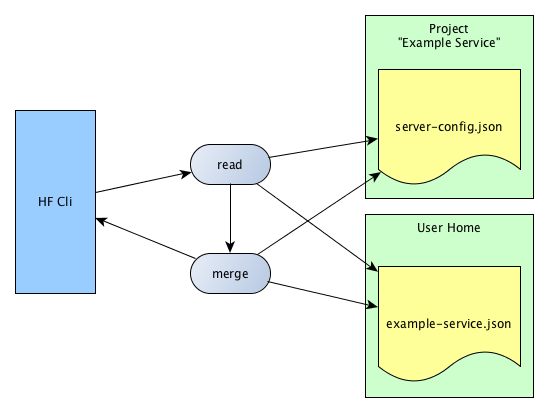

title: Heringsfish - Configuration
---


# Configuration

The configure settings are in the file `server-config.json`. This file is in the project root directory and has format `JSON`.

Similarly, there may be a JSON file in your home directory that overwrites the project configuration. The name of the file in your home directory is the project name. All characters are lowercase and the spaces are replaced by '-'.

## Example of Override

* Your Project has the name `Example Service` and it is under the directory `/home/berti/projects/example-service`.
* The project config file is `server-config.json`.
* Your override config is in your home directory and has the name `example-service.json`.




The user configs is always override the project configs.


## Table of Configurable Settings

| Settings            | Type         | Required | Description
|---------------------|--------------|:--------:|-----------------------------------------------------------
| `name`              | String       | yes      | The application name.
| `version`           | String       | yes      | A version
| `server.home`       | String       | yes      | The path to the Application Server
| `maven.home`        | String       | yes (1)  | The path to the Maven installation
| `maven.setting`     | String       | yes (1)  | The Maven settings.xml file
| `maven.project`     | String       | yes (1)  | The `pom.xml`of the Project.
| `ant.home`          | String       | yes (2)  | The path to the Ant installation.
| `domain.name`       | String       | yes      | The domain name in the Application Server.
| `domain.home`       | String       | yes      | The path to the domain directory.
| `domain.deploy`     | Map          | yes      | A map with the deployment files.
| `domain.ports.base` | Number       | yes      | The base port of the application (Admin Console Port is `+ 48`, The application is on `+ 80`).
| `domain.jdbc`       | Map          | yes      | A map with the jdbc names and their settings.
| `command.timeout`   | Number       | yes      | The timeout in milliseconds. If the value is `0`, then it is running infinity.
| `command.asadmin`   | Object       | yes      | The `asAdmin` command. There can be different commands for different platforms
| `command.maven`     | Object       | yes      | The `mvn` command. There can be different commands for different platforms
| `command.ant`       | Object       | yes      | The `ant` command. There can be different commands for different platforms
| `settings`          | Object       | yes      | All keys / values under this property can be referenced in the configuration.
| `env`               | Object       | yes      | A key value map for the environment variables that is setting for the Application Server.

* (1) Only when the project use Maven for building the java packages
* (2) Only when the project use Ant for building the java packages

### Example of Configure

```json
{
    "name": "test-project",
    "version": "0.1.0-SNAPSHOT",
    "server": {
        "home": "{user.home}/programs/payara-4.1.1.154"
    },
    "maven": {
        "home": "{user.home}/programs/maven-3.3.4",
        "setting": "{project.home}/setting.xml",
        "project": "{project.home}/projects/pom.xml"
    },
    "ant": {
        "home": "{user.home}/programs/ant-1.10.0"
    },
    "domain": {
        "name": "test-project",
        "home": "{project.home}/domains",
        "deploy": {
            "rest-provider": "{project.home}/projects/rest-provider/target/rest-provider-0.1.0-SNAPSHOT.war",
            "business-beans": "{project.home}/projects/business-beans/target/business-beans-0.1.0-SNAPSHOT.jar"
        },
        "ports": {
            "base": 50000
        },
        "jdbc": {
            "testDB": {
                "dataSourceClassName": "com.mysql.jdbc.jdbc2.optional.MysqlDataSource",
                "restype": "javax.sql.DataSource",
                "properties": {
                    "user": "{database.user}",
                    "password": "{database.password}",
                    "url": "jdbc:mysql://localhost:{database.port}/test"
                },
                "description": "This is the Test Database"
            }
        }
    },
    "command": {
        "timeout": 120000,
        "asadmin": {
            "win32": "{server.home}/bin/asadmin.bat",
            "unix": "{server.home}/bin/asadmin"
        },
        "maven": {
            "win32": "{maven.home}/bin/mvn.cmd",
            "unix": "{maven.home}/bin/mvn"
        },
        "ant": {
            "win32": "{ant.home}/bin/ant.bat",
            "unix": "{ant.home}/bin/ant"
        }
    },
    "settings": {
        "database": {
            "user": "db user",
            "password": "secret password",
            "port": 3306
        },
        "email-password": "email secrets"
    },
    "env": {
        "project.home": "{project.home}",
        "user.home": "{user.home}",
        "project.name": "{project.name}",
        "project.version": "{project.version}"
    }
}
```
